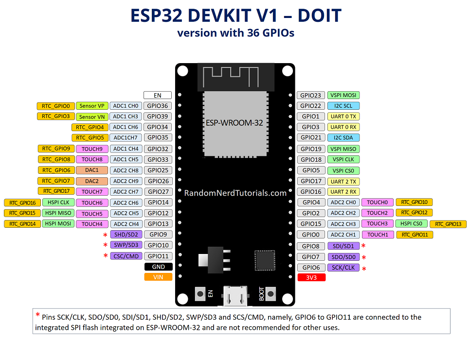

# 💪CODOS💪

## Un sistema de bajo coste basado en ESP32 para la detección del CO2 para el aula

"Algunos científicos comentan que mejorar la ventilación y la calidad del aire es un método que las escuelas pueden usar para reducir el riesgo de transmisión del coronavirus.
Sin embargo, en una encuesta entre distritos escolares grandes del Norte de Texas, The Dallas Morning News encontró que las escuelas están lejos de alcanzar los parámetros de calidad del aire propuestos en junio por expertos en construcción.  
Investigadores de la Universidad de Harvard recomendaron instalar filtros de aire de alta graduación, limpiadores de aire portátiles y fuentes de luz ultravioleta dentro de los conductos de aire para eliminar al virus.
Al revisar el nivel de dióxido de carbono en las aulas se puede comprobar si está entrando suficiente aire fresco..."

Fuente: https://noticiasenlafrontera.net/escuelas-no-siguen-recomendaciones-de-calidad-del-aire-parar-reducir-exposicion-a-covid-19/

Existen además evidencias de que los altos niveles de CO2 influyen sobre el rendimiento de los alumnos en el aula.
https://pubmed.ncbi.nlm.nih.gov/25117890/

Artículos cómo este me han llevado a elaborar un pequeño dispositivo de bajo coste que permita monitorizar los niveles de CO2 en las aulas con el objeto de poder medir la concentración de dicho gas y de esta forma saber cuándo tenemos que renovar el aire de un aula para poder seguir de la mejor forma posible las propias indicaciones al respecto de las administraciones públicas españolas:

https://www.miteco.gob.es/es/ministerio/medidas-covid19/sistemas-climatizacion-ventilacion/default.aspx

Utilizando una hoja de cálculo podemos calcular la cantidad de CO2  en función de diversas variables del aula. En el siguiente artículo tenemos una calculadora que permite hacer dicho cálculo:

https://medium.com/@jjose_19945/how-to-quantify-the-ventilation-rate-of-an-indoor-space-using-a-cheap-co2-monitor-4d8b6d4dab44

##¿Qué es CODOS?

CODOS es un pequeño circuito electrónico construido sobre un microcontrolador ESP32, similar a un Arduino pero que ofrece conectividad WIFI y Bluetooth, esto lo convierte en un dispositivo de Internet de las Cosas, (IoT) lo que nos permite monitorizar los datos de los sensores conectados al mismo a través de Internet. El dispositivo está pensado para medir la cantidad de CO2 y otros parámetros ambientales para recomendarnos cuando deberíamos renovar el aire de un aula cuando no se disponga de un sistema de ventilación forzada o bien no sea posible mantener las ventanas abiertas todo el tiempo.

Con un simple Arduino, un sensor de CO2 y unos led podemos construir un sistema simplificado que permita indicar cuando los niveles de CO2 están dentro de unos determinado umbrales, esa fue mi primera idea y publicaré también esta versión; pero cambiando el Arduino por un ESP8266 o un ESP32 podemos además enviar los datos a un servidor y monitorizar por ejemplo los datos de distintas aulas de forma centralizada, almacenar datos estadísticos en una base de datos o realizar otras muchas tareas que podrían sernos útiles sin incrementar prácticamente el coste del dispositivo.

###BOM (Bill of materials) / Lista de materiales
En su versión IoT, para construir CODOS se necesitan los siguientes elementos:
- Un ESP32 por ejemplo el ESP32-DOIT-DEVKIT
- Un sensor de CO2 CC811 (he probado tambiémn con otros sensores como el Sensirion SDC30 pero su coste es mucho más elevado)
- Opcionalmente un sensor de humedad, presión y temperatura BME280
- Opcionalmente leds de varios colores por ejemplo rojo, naranja y verde para construir un "semáforo" que indique los niveles de CO2
- Opcionalmente una pantalla OLED SSD1306 u otra

Téngase en cuenta que los datos podrán visualizarse desde cualquier dispositivo conectado a la misma red que CODOS: el ordenador del profesor, una tablet o un móvil, incluso puede conectarse a Internet y enviar los datos a un servidor externo para que estos puedan visualizarse desde cualquier sitio, por lo que los elementos opcionales se utilizarán o no en función de las necesidades de cada caso.

(este documento está en redacción)